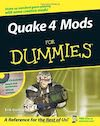
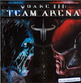
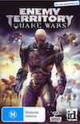

# Quake Books List

List of all books on the Quake games by id Software.

## History and Biography

| Author  | Title | Publisher | Year | Pages | ISBN-10 | ISBN-13 |
| --- | --- | --- | --- | --- | --- | --- |
David Kushner | [Masters of Doom: How Two Guys Created an Empire and Transformed Pop Culture](https://amzn.to/3EhDEDJ) | Random House | 2004 | 368 | 9780812972153 | 978-0812972153
David L. Craddock | [Rocket Jump: Quake and the Golden Age of First-Person Shooters](https://amzn.to/3YSo237) | Independent | 2019 | 395 | 1070183601 | 978-1070183602
John Romero | [Doom Guy: Life in First Person](https://amzn.to/3QUT0FO) | Harry N. Abrams | 2023 | 384 | 141975811X | 978-1419758119

## Technical Books

| Author  | Title | Publisher | Year | Pages | ISBN-10 | ISBN-13 |
| --- | --- | --- | --- | --- | --- | --- |
Matt Tagliaferri | [Unofficial Quake Level Design Handbook](https://www.google.com/books/edition/Quake_Level_Design_Handbook/BiRs6j8RsMEC) | Sybex | 1996 | 350 | 0782121187 | 978-0782121186
Michael Abrash | [Michael Abrash's Graphics Programming Black Book (Special Edition)](https://amzn.to/45RXbGL) | Coriolis Group | 1997 | 1342 | 1576101746 | 978-1576101742
Shawn Holmes | [Focus On Mod Programming in Quake III Arena](https://amzn.to/45uSOSd) | Course Technology | 2002 | 304 | 193184156X | 978-1931841566
David W. R. Rule | [The Art of Quake](https://amzn.to/3svH9E7) | Blurb | 2010 | 88 | 132068730X | 978-1320687317
Erik Guilfoyle | [Quake 4 Mods For Dummies](https://amzn.to/44Bwq88) | Wiley | 2006 | 388 | 0470072601 | 978-0470072608

## Quake Strategy Guides

| Author  | Title | Publisher | Year | Pages | ISBN-10 | ISBN-13 |
| --- | --- | --- | --- | --- | --- | --- |
Kevin Perry and Ed Dille | [Quake Authorized Strategy Guide](https://amzn.to/3R0BRub) | Ventana | 1996 | 228 | 1566046084 | 978-1566046084 |
BradyGames Staff | [Quake Authorized Strategy Guide](https://amzn.to/3PftIku) | Brady Publishing | 1996 | 167 | 1566864941 | 978-1566864947
Kip Ward and Mike Van Mantgem | [Prima's Quake Strategy Guide Unauthorized](https://amzn.to/3EmPZX6) | Prima Games | 1996 | 240 | 0761505326 | 978-0761505327
Kip Ward and Mike Van Mantgem | [Prima's Quake Unauthorized Map Guide](https://amzn.to/3QW4kBD) | Prima Games | 1996 | 160 | 076150513X | 978-0761505136
Kip Ward and Mike Van Mantgem | [Prima's Quake Game Secrets](https://amzn.to/3L2JGvA) | Prima Games | 1996 | 112 | 0761509089 | 978-0761509080
Kyle R. Hofmann | [How to Attain Mastery Of Quake](https://amzn.to/3L99Pce) | Future Publishing (PC Gamer) | 1996 | ? | n/a | n/a
E. Cameron | [Quake Strategies The Official Book](https://amzn.to/3sHIUy4) (French) (Quake Stratégies Le Livre Officiel) | Pearson | 1996 | 199 | 2744002232 | 978-2744002236
Kip Ward, Mike Van Mantgem, and Alex Floyd | [Prima's Unauthorized Game Secrets: Quake for Nintendo 64](https://amzn.to/3OYRqQw) | Prima Games | 1998 | 112 | 0761512160 | 978-0761512165
Craig Wessel | [Quake Authorized Strategy Guide: Nintendo 64](https://amzn.to/3sAcIg0) | Brady Publishing | 1998 | 117 | 1566867290 | 978-1566867290
Roy Kimber and Andy McDermott | [Complete Solutions to Quake II and Quake](https://www.google.com/books/edition/Complete_Solutions_to_Quake_II_and_Quake/VTSIOwAACAAJ) | Paragon Publishing | 1999 | ? | ? | ?

## Quake II Strategy Guides

| Author  | Title | Publisher | Year | Pages | ISBN-10 | ISBN-13 |
| --- | --- | --- | --- | --- | --- | --- |
John K. Waters and Michael Koch | [Quake II: Authorized Strategy Guide](https://amzn.to/3qKJmuV) | GW Press | 1997 | 268 | 1568939590 | 978-1568939599
Craig Wessel | [Quake II: Authorized Strategy Guide](https://amzn.to/45NFGHs) | Brady Publishing | 1997 | 168 | 1566867312 | 978-1566867313
Jonathan Mendoza, Dennis "Thresh" Fong, and Kenn "Spear" Hwang | [Official Quake II: Strategies & Secrets](https://amzn.to/45x84xL) | Sybex | 1997 | 279 | 0782122124 | 978-0782122121
A. N. Drachenko (edited) | Official Quake II: Strategies & Secrets (Russian) (Quake II. Стратегии и секреты. Официальное руководство) | Dialektika | 1998 | 293 | 0782122124 | 966-5061429
Joe Grant Bell, Steve Honeywell, Chris Jensen, and Kip Ward | [Prima's Unauthorized Guide to Quake II: Maps!](https://amzn.to/3Eh4LyX) | Prima Games | 1998 | 208 | 076151306X | 978-0761513063
Joe Grant Bell | [Prima's Official Strategy Guide: Quake II (PlayStation)](https://amzn.to/45xyQpG) | Prima Games | 1999 | 80 | 076152200X | 978-0761522003
Steve Honeywell | [Prima's Official Strategy Guide: Quake II (N64)](https://amzn.to/3YYZkhr) | Prima Games | 1999 | 112 | 0761522018 | 978-0761522010
Rob Waterworth | [Quake II: Every Level Sliced! Every Baddie Diced!](https://www.google.com/books/edition/Quake_II/HcSPMwEACAAJ?hl=en) | IDG Media | 1999 | 64 | ? | ?
Jonathan Mendoza | [Quake II: The Reckoning Official Strategies & Secrets](https://amzn.to/3qJGw9u) | Sybex | 1999 | 176 | 0782123007 | 978-0782123005
? | [Quake 2 Solution Book: Unofficial Game Solutions](https://amzn.eu/d/cfEa7ky) (German) (Quake 2 Lösungsbuch: Inoffizielle Spielelösungen) | GamePress | ? | ? | ? | ?
? | [Quake 2: Down and Dirty](https://openlibrary.org/works/OL8495880W/Quake_2?edition=key%3A/books/OL10905181M) | Prima Games | 1999 | ? | 0761515305 | 978-0761515302

## Quake III Arena Strategy Guides

| Author  | Title | Publisher | Year | Pages | ISBN-10 | ISBN-13 |
| --- | --- | --- | --- | --- | --- | --- |
Steve Honeywell | [Prima's Official Strategy Guide: Quake III Arena](https://amzn.to/4868Rrk) | Prima Games | 1999 | 200 | 0761525882 | 978-0761525882
Piotr Szczerbowski | [Quake III: Arena](https://www.google.com/books/edition/Quake_III_Arena/XSgREAAAQBAJ) (Polish) | GRY Online | 2001 | 27 | 5042741569 | 978-5042741562
Piotr Szczerbowski | [Urban Terror](https://www.google.com/books/edition/Urban_Terror/LSQREAAAQBAJ) (Polish) | GRY Online | 2001 | ? | 5042735712 | 978-5042735714
Makoto Ogasawara (小笠原誠) | [Quake Complete Strategy Guidebook](https://amzn.to/3qWiWGx) (Japanese) (Quake完全攻略ガイドブック) | ASCII (アスキー) | 1997 | 111 | 4756112781 | 978-4756112781

## Quake 4 Strategy Guides

| Author  | Title | Publisher | Year | Pages | ISBN-10 | ISBN-13 |
| --- | --- | --- | --- | --- | --- | --- |
Stephen Stratton and Bryan Stratton | [Quake 4 Official Game Guide](https://amzn.to/3sHAuXc) | Prima Games | 2005 | 224 | 0761552634 | 978-0761552635
Stephen Stratton and Bryan Stratton | [Quake 4 XBOX 360 Official Game Guide](https://amzn.to/45LSeiM) | Prima Games | 2005 | 222 | 0761552626 | 978-0761552628

## Enemy Territory: Quake Wars Strategy Guides

| Author  | Title | Publisher | Year | Pages | ISBN-10 | ISBN-13 |
| --- | --- | --- | --- | --- | --- | --- |
Phillip Marcus and Rick Barba | [Enemy Territory: Quake Wars Brady Games Signature Series Guide](https://amzn.to/3R8F4Z2) | Brady Publishing | 2008 | 256 | 0744009472 | 978-0744009477
Maciej Jałowiec | [Enemy Territory: Quake Wars](https://www.google.com/books/edition/Enemy_Territory_Quake_Wars/eicREAAAQBAJ) (Polish) | GRY Online | 2007 | ? | 5042740767 | 978-5042740763

## Quake Champions Strategy Guides

| Author  | Title | Publisher | Year | Pages | ISBN-10 | ISBN-13 |
| --- | --- | --- | --- | --- | --- | --- |
n/a | [Quake Champions Player's Journal](https://amzn.to/482YlkD) | Prima Games | 2017 | 192 | 0744018463 | 978-0744018462

## Quake Fiction

| Author  | Title | Publisher | Year | Pages | ISBN-10 | ISBN-13 |
| --- | --- | --- | --- | --- | --- | --- |
Ram V and Alan Quah | [Quake Champions Issue 1](https://amzn.to/45ST1hI) | Titan Comics | 2017 | 31 | n/a | n/a
Ram V and Alan Quah | [Quake Champions Issue 2](https://amzn.to/3PpYgjm) | Titan Comics | 2017 | 28 | n/a | n/a
Ram V and Alan Quah | [Quake Champions Issue 3](https://amzn.to/3PoFwRq) | Titan Comics | 2017 | 48 | n/a | n/a
Ram V and Alan Quah | [Quake Champions Issue 4](https://amzn.to/4820NYi) | Titan Comics | 2018 | 2 | n/a | n/a
Ram V and Alan Quah | [Quake Champions Vol 1](https://amzn.to/3EngprN) | Titan Comics | 2018 | 112 | 1785863428 | 978-1785863424
Ram V and Alan Quah | [Quake Champions Vol 1](https://amzn.to/3sKmPP8) (Russian) (Quake Champions Graficheskiy Roman) | AST | 2019 | 112 | 5171123993 | 978-5171123994

## Quake Manuals

| Game  | Platform | Publisher | Year | Pages |
| --- | --- | --- | --- | --- |
Quake | PC | id Software | 1996 | 22
Quake (Read Me Text) | PC | id Software | 1996 | 52
Quake Mission Pack 1 | PC | Hipnotic | 1997 | 25
Quake Mission Pack 2 | PC | Rogue | 1997 | 27
Quake | N64 | Midway | 1997 | 30
Quake II | PC | id Software | 1997 | 22
Quake II Mission Pack 1 | PC | Xatrix | 1998 | 32
Quake II Mission Pack 2 | PC | Rogue | 1997 | 34
Quake II | PS | Hammerhead | 1999 | 28
Quake II | N64 | Raster | 1999 | 18
Quake III Arena | PC | id Software | 1999 | 40
Quake III Team Arena | PC | id Software | 2000 | 18
Quake III Arena | Dreamcast | Raster | 2000 | 32
Quake III Revolution | PS2 | Bullfrog | 2001 | 19
Quake 4 | XBOX 360 | Raven | 2005 | 24
Quake 4 | PC | Raven | 2005 | 20
Enemy Territory: Quake Wars | PC | Splash Damage | 2006 | 22

## References and Dissertations

| Author  | Title | Type | Publisher | Year | Pages |
| --- | --- | --- | --- | --- | --- |
David "DarkGrue" Hesprich | QuakeC Reference Manual | Reference | n/a | 1998 | 70
Rohan Wilson | [The Cultural and Textual Aspects of Id Software's Quake](https://www.google.com/books/edition/The_Cultural_and_Textual_Aspects_of_Id_S/4HFangEACAAJ) | Masters | University of Tasmania | 1998 | 102
J. M. P. van Waveren | [Quake III Arena Bot](http://www.kbs.twi.tudelft.nl/Publications/MSc/2001-VanWaveren-MSc.html) | Masters | University of Technology Delft | 2001 | 118
Hector Villena Cazorla | Multiple Potential Fields in Quake 2 Multiplayer | Masters | Blekinge Institute of Technology | 2006 | 66

## Cover Art

### History and Biography

### Technical Books

### Quake Strategy Guides

### Quake II Strategy Guides

### Quake III Arena Strategy Guides

### Quake 4 Strategy Guides

### Enemy Territory: Quake Wars Strategy Guides

### Quake Champions Strategy Guides

### Quake Fiction

### Quake Manuals

## About

The goal of this project is to identify all books on or that cover Quake.

Book must have at least one chapter on or about Quake, Quake II, or Quake III Arena.

It is inspired by the [doom list of books](https://doomwiki.org/wiki/List_of_books), but for Quake.

Some books are linked to Google Books and some to Amazon. As an Amazon Associate I earn from qualifying purchases.

### Why?

Because I love Quake and I love books.

### Where To Get The Books?

Most of the books are out of print.

Many of the books come with a CD.

Secondhand copies of books can be found on Amazon and eBay.

Many of the books can also be found in digital format elsewhere online, such as the [Internet Archive](https://archive.org/), [Retromags](https://www.retromags.com/), and [Anna's Archive](https://annas-archive.org/).

### Help

Am I missing a book on Quake?

Do you know about a book that has a chapter on Quake?

Let me know: Jason.Brownlee05@gmail.com

